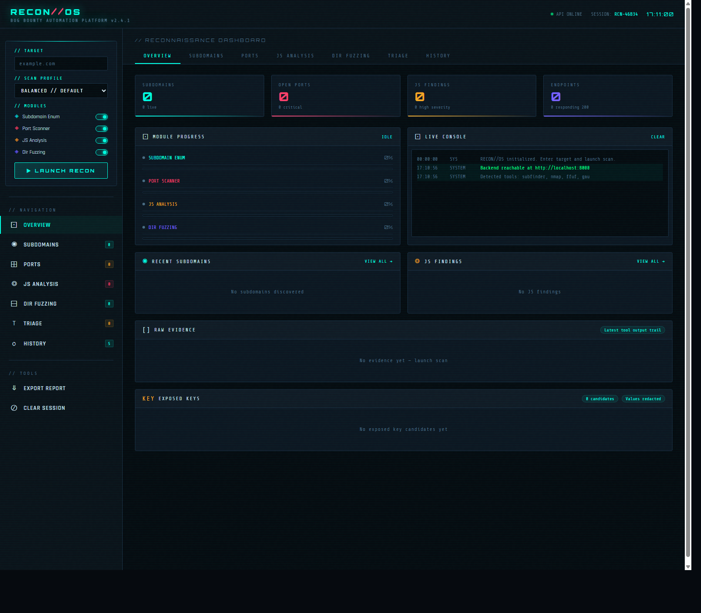

# RECON//OS

Bug bounty recon automation platform with a Django backend and SQLite3 database, real tool integrations, live scan streaming, scan history, diffing, triage, and report exports.

## Preview



## What It Does

RECON//OS is a local-first reconnaissance dashboard built for bug bounty and authorized attack-surface mapping workflows. The frontend provides a live operational view of each scan, while the backend runs actual recon modules and streams results in real time over Server-Sent Events.

Core capabilities:

- Real subdomain enumeration with `subfinder` and DNS fallback
- DNS recon for `A`, `AAAA`, `MX`, `NS`, `TXT`, `CNAME`, SPF, DMARC, DKIM visibility, wildcard DNS checks, and AXFR probing
- Port scanning with `nmap` and Python fallback logic
- Tech fingerprinting through headers, framework signals, WAF/CDN detection, and TLS certificate parsing
- JavaScript analysis with source map handling, endpoint extraction, GraphQL detection, and secret pattern analysis
- URL intelligence through archived URLs, parameter discovery, interesting file detection, and hidden API-route discovery
- Directory and content discovery with `ffuf`, extension fuzzing, similarity filtering, and recursion
- Saved scan history, side-by-side diffs, triage workflows, and JSON/Markdown/HTML report exports

## Stack

- Frontend: HTML, CSS, JavaScript
- Backend: Django
- Streaming: Server-Sent Events
- Persistence: SQLite
- Tests: Python `unittest`

## Repo Layout

```text
.
|-- recon.html
|-- recon_api.py
|-- setup_recon_win.ps1
|-- setup_recon.ps1
|-- setup_recon.sh
|-- install_tools_win.ps1
|-- tests/
`-- docs/
    `-- images/
```

## Quick Start

### Windows

1. Create and activate your virtual environment if needed.
2. Run the tool installer:

```powershell
powershell -NoProfile -ExecutionPolicy Bypass -File .\install_tools_win.ps1
```

3. Start the app:

```powershell
powershell -NoProfile -ExecutionPolicy Bypass -File .\setup_recon_win.ps1
```

4. Open:

- `http://localhost:8000`
- `http://localhost:8000/docs`

### PowerShell / cross-platform launcher

```powershell
powershell -NoProfile -ExecutionPolicy Bypass -File .\setup_recon.ps1
```

### Bash launcher

```bash
bash ./setup_recon.sh
```

## Real Scan Model

This project is designed to perform real recon activity, not fake dashboard playback. When external tools are available, the backend uses them directly. When they are not available, it falls back to explicit Python-based probes where possible. Findings are still recon leads and should be manually validated before disclosure.

Examples:

- An open port is a real network observation, not automatically a vulnerability.
- A JS secret match is a real pattern hit in fetched content, but still needs manual validation.
- A discovered path or endpoint is evidence of exposed surface area, not always a reportable issue by itself.

## Recommended Optional Tools

- `subfinder`
- ProjectDiscovery `httpx`
- `nmap`
- `ffuf`
- `gau`

The setup scripts will check for these tools and fall back when possible.

## Running Tests

```powershell
.\recon\Scripts\python.exe -m unittest discover -s tests -v
```

## Safety

Only scan targets you own or have written permission to test. This project is meant for authorized security research and internal recon workflows.

## Suggested GitHub Repo Description

Django-powered bug bounty recon dashboard with real tool integrations, live scan streaming, history diffing, triage, and report exports.
